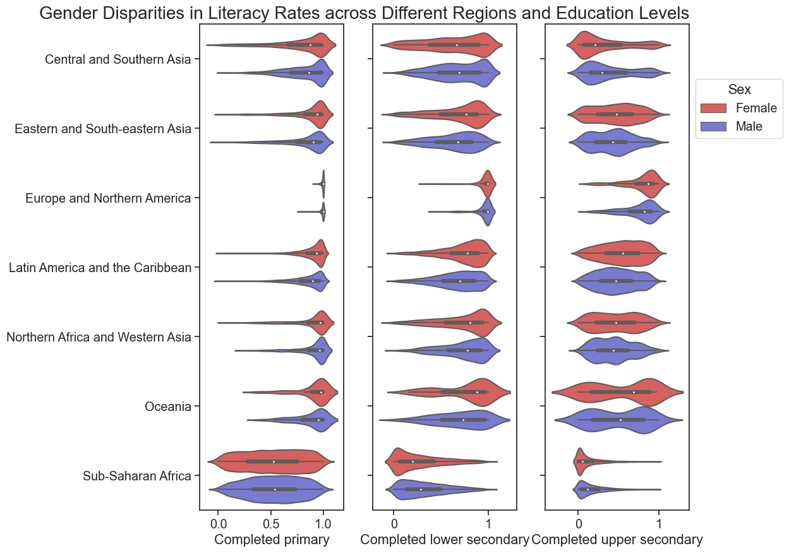
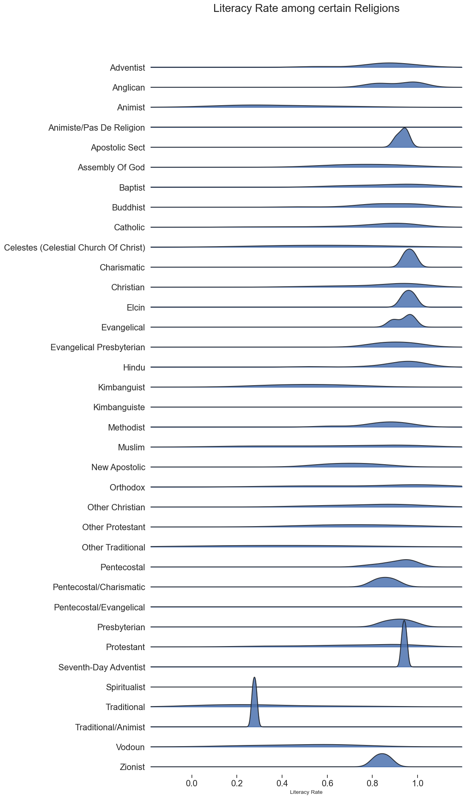
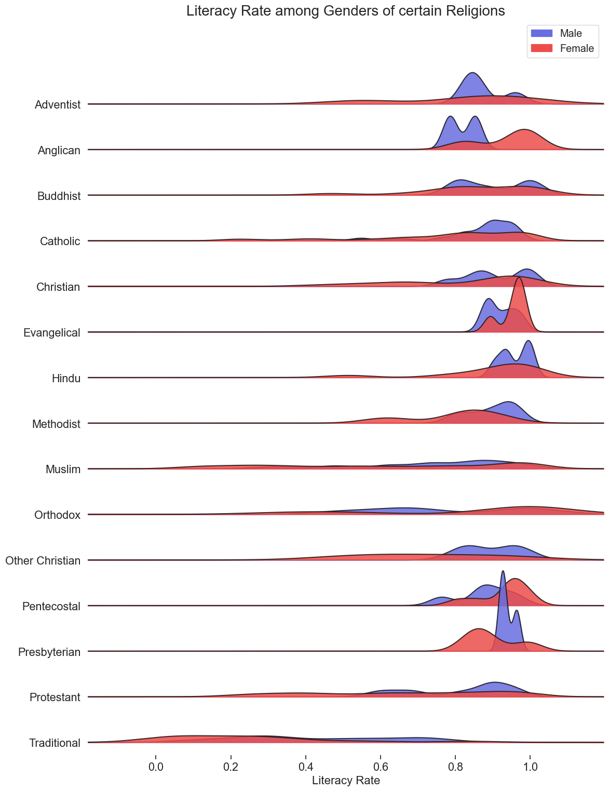
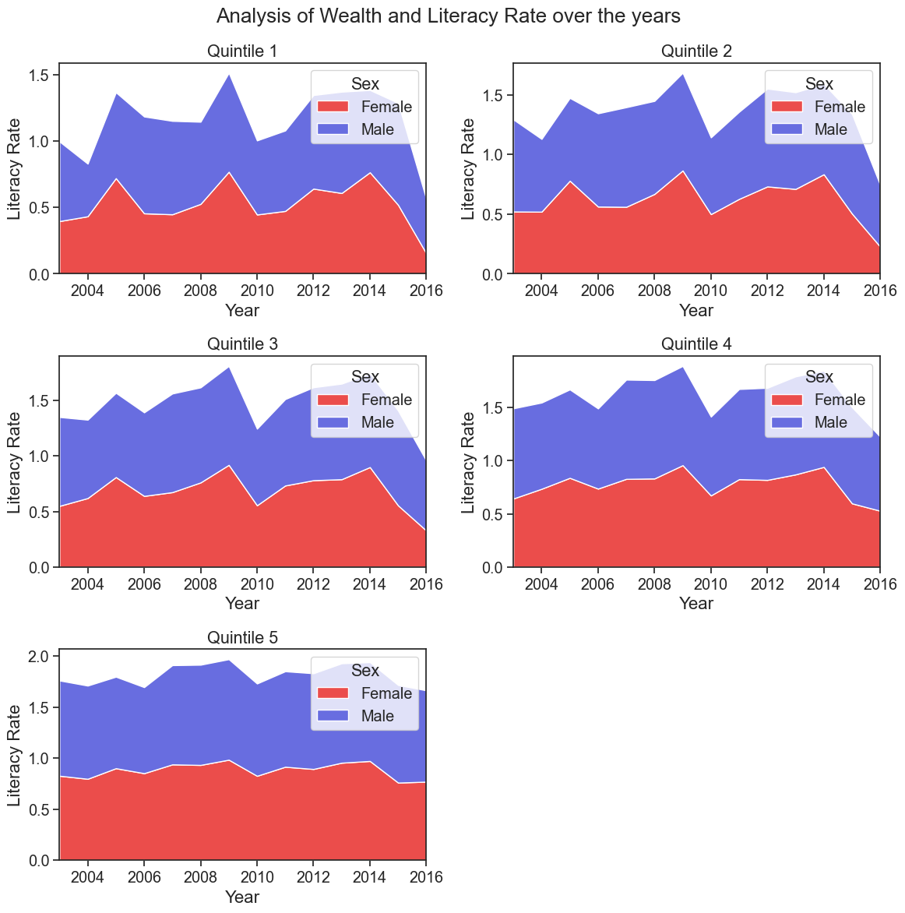
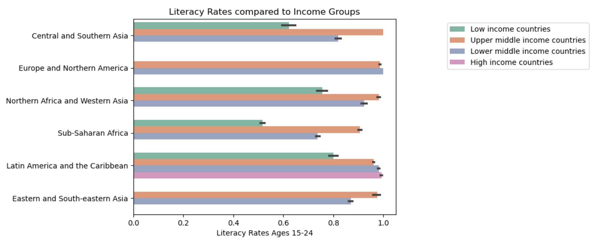
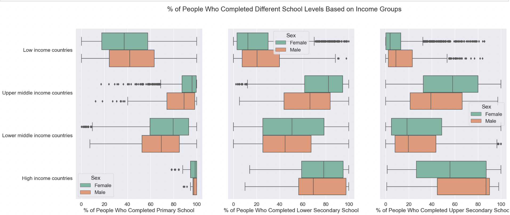
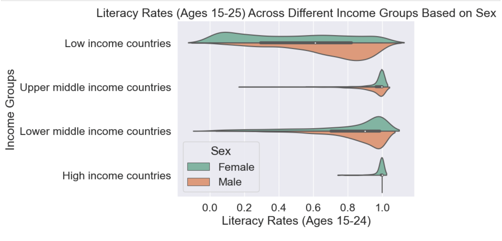

# **Literacy Rates**
## Exploratory Data Analysis

## How has the gender gap in literacy changed?
To evaluate if there is a gender gap when it comes to literacy rates, the analysis was done using factors that are known to affect literacy rates such as wealth, religion, and the levels of education completed. These factors were answered using subquestions.

#### **Concerning certain regions, which gender is known to have a higher literacy rate?**

This graph was analysing the literacy rate based on the completion of school. In this graph, we were able to analyse the spread of data and the common percentage of those who completed each level of education. It was split according to gender to determine if there was gap in the attendance of a certain gender. The conclusion when it came to this was that there were no wide gaps in certain regions. However, the attendance of females dropped in certain regions such as Central and Southern Asia, Sub-Saharan Africa.

#### **Does religion play a role in the literacy rate? Is there a particular gender that is more educated?**

When comparing the literacy rates of different religions, some, such Seventh-Day Adventists, Zionists, Christians, etc., come into the category of having a high literacy rate. While the literacy rates of some religions vary greatly, the majority of them, like Traditional/Animist, lie within the lower range. In accordance with the plot, there are discrepancies in the rates of literacy for men and women according to various religions. Our statistics on Muslims, for example, show that while female literacy rates varied from 0% to 100%, a larger percentage of Muslim women fell between the ranges of 80% and 100%. The literacy rate among Muslim men ranged from 60% to 80%. The aforementioned plot leads us to the conclusion that it is impossible to determine for sure if there are factors that cause religion to have a direct impact on the literacy rate.

#### **What is the effect of wealth on literacy rate among a particular gender?**

Looking at all these quintiles, which range from the poorest to the richest, it is clear that women often have a lower literacy rate than men. Over the years, for the first three quintiles, the female literacy drops significantly in 2016 as compared to 2014 which seemed to have the high female literacy rate.
The females literacy rate might be much lower in the quintile 1 and quintile 2 because of societal factors such as the belief the woman should work at home and take care of the household or the idea that women should take up more nurturing roles where education might not be needed. Quintile 4 and Quintile 5 has a higher literacy rate for the women.

In general, when answering the question on the gender gap in the literacy rates. There is a gender gap in literacy rates. In certain regions of this world, it is not a wide gap. However, it was found out that men take the lead in a lot of factors concerning literacy rates.

## How do different income levels affect the literacy rate throughout the world?
To answer my question, I will be comparing four different income groups, low-income, lower-middle income, upper-middle income, and high income countries. I will be comparing these groups to other factors such as region, sex, and education level. These factors will help us understand exactly how wealth impacts the literacy rate around the world.

#### How does the literacy rate change around the world?

This plot analyzes the literacy rates based on different income groups in different regions of the world. Using this plot, we can notice that there is a common trend between each region, the lower-income countries have a significantly lower literacy rate than the higher-income countries. In fact, the higher-income countries were close to having a 100% literacy rate in most regions. On the other hand, low-income countries had an average of a 60% literacy rate throughout the regions. Because the higher-income countries had a much higher literacy rate, we can conclude that wealth does impact the literacy rate throughout the world.

#### How does the education level change when compared to income groups based on sex?

These plots compare the percentage of people who completed a certain educational level per income group based on sex. The plot on the left explores the percentage of people who completed primary school. We discover that throughout most of the income levels, on average, 80+% of people completed primary school. However, in low-income countries, the average was only 40%. In the middle graph, we discover that the average percentage of people who completed lower secondary school is lower than that of primary school. This is especially true in middle-income countries as high-income countries still have a relatively high completion rate. In the graph on the left, we notice that the average percentage of people who completed upper secondary school significantly dropped in every income group when compared to previous education levels. The higher-income countries continue to have a higher completion rate, however, it is only at around 50%. In middle-income countries, females have a higher average completion rate than males.

#### How does the literacy rate change across different income groups based on sex? 

This plot compares the literacy rate across different income groups based on sex. We notice that throughout every income group, males had higher literacy rates than women. Only low-income countries did not have an almost 100% literacy rate for males. The higher the income, the higher the literacy rate. 

## Conclusion

<u> **Links**:</u>

You can find the full analysis for gender and literacy rates notebook [here](https://github.com/ubco-W2022T2-data301/project-group-group18/blob/main/analysis/analysis3.ipynb).
If you want the code for the graphs, click [here](https://github.com/ubco-W2022T2-data301/project-group-group18/blob/main/analysis/scripts/project_functions3.py).

Full analysis for income groups and literacy rates [here](https://github.com/ubco-W2022T2-data301/project-group-group18/blob/main/analysis/analysis2.ipynb)
Code for analysis 2 [here](https://github.com/ubco-W2022T2-data301/project-group-group18/blob/main/analysis/scripts/project_function2.py)